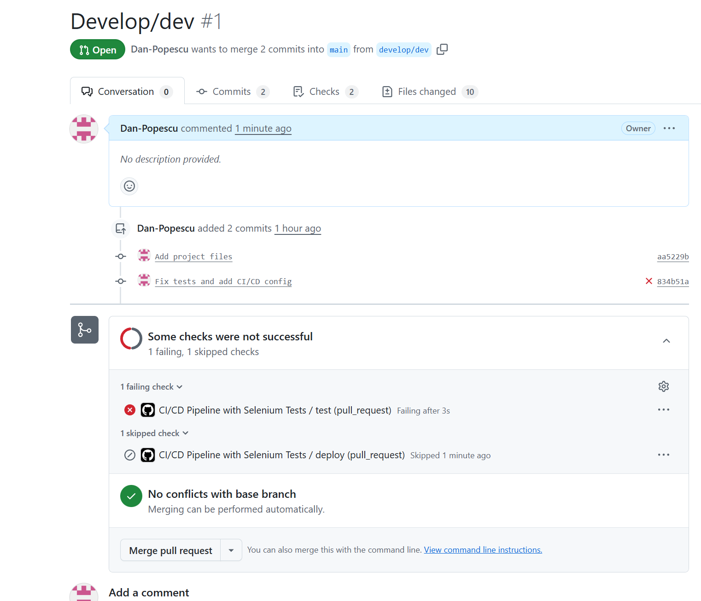
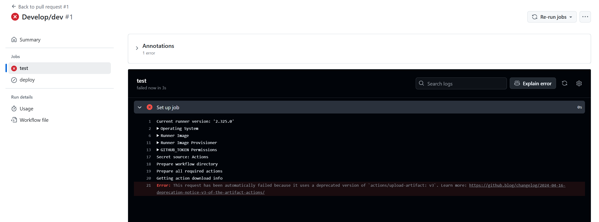

# Partie 2 : Configuration de Selenium

La configuration était source d'erreur car la fonction qui initialisait le driver ne renvoyer pas une valeur 
dans tout les cas, mais faisait partie d'un bloc d'instruction if. Dans le cas où la condition du bloc if 
n'était pas vérifié, la fonction def ne renvoyait rien. 

Afin de corrige le problème, la fonction a été modifée comme ceci : 
```
    def driver(self):
        """Configuration du driver Chrome pour les tests"""
        chrome_options = Options()

        driver = None

        # Configuration pour environnement CI/CD
        if os.getenv('CI'):
            chrome_options.add_argument('--headless')
            chrome_options.add_argument('--no-sandbox')
            chrome_options.add_argument('--disable-dev-shm-usage')
            chrome_options.add_argument('--disable-gpu')
            chrome_options.add_argument('--window-size=1920,1080')

        chrome_install = ChromeDriverManager().install()
        folder = os.path.dirname(chrome_install)
        chromedriver_path = os.path.join(folder, "chromedriver.exe")
        service = webdriver.ChromeService(chromedriver_path)

        driver = webdriver.Chrome(service=service, options=chrome_options)
        driver.implicitly_wait(10)

        yield driver
        driver.quit()
```




